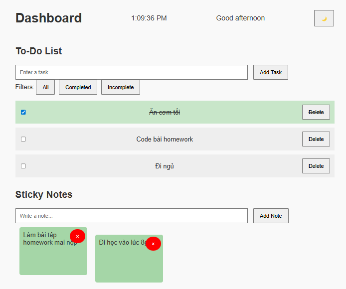

# 🧩 **Homework JS DOM: Interactive To-Do & Notes Dashboard**

## 🎯 **Objective:**

Build an interactive **To-Do & Notes Dashboard** using **HTML, CSS, and JavaScript**. This project will focus on **DOM manipulation**, **event handling**, and **dynamic content updates** without using any libraries or frameworks.

---

## 📄 **Project Description:**

You will create a web-based dashboard that includes:

1. A **To-Do List**: where users can add, delete, mark tasks as complete, and filter tasks.
2. A **Sticky Notes Section**: where users can add and remove short notes.
3. A **Live Clock** and **Greeting Message** based on the time of day.
4. A **Theme Switcher**: allowing users to toggle between dark and light mode.
5. A **Local Storage Integration** (optional/bonus): save todos and notes locally.

---

## 📋 **Feature Requirements:**

### ✅ 1. To-Do List

* Input field and **Add** button to create new tasks.
* Display tasks as a list.
* Each task should have:

  * A checkbox to mark as completed.
  * A "Delete" button to remove the task.
* Filter buttons:

  * Show All
  * Show Completed
  * Show Incomplete

---

### ✅ 2. Sticky Notes

* Input field or popup/modal to create a new note.
* Notes appear as colored boxes with text.
* Each note has a **Delete** (×) button.
* Random background color from a preset palette.

---

### ✅ 3. Theme Switcher

* Add a toggle button (🌙/☀️) to switch between light and dark themes.
* Use CSS classes to change theme.

---

### ✅ 4. Form Validation (for notes/tasks input)

* Do not allow empty inputs.
* Show error message below the input field if user tries to add empty input.

---

### 🏅 **Extra Features :**

* Save tasks and notes in `localStorage` and load them on page refresh.
* Add "Edit Task" or "Edit Note" functionality.
* Use drag & drop to reorder tasks or notes.

---

## 🔧 **Technical Constraints:**

* **Do not use any JavaScript libraries/frameworks** (e.g., jQuery, React).
* Use only **vanilla JavaScript**, **HTML**, and **CSS**.
* All DOM interactions must be done via native JavaScript.

---

## 📦 **Deliverables:**

* A folder containing:

  * `index.html`
  * `style.css`
  * `script.js`
* Or Google Drive / a GitHub repo link

## 📦 **Demo:**

This is a demo. You are encouraged to design a more creative and beautiful UI.

